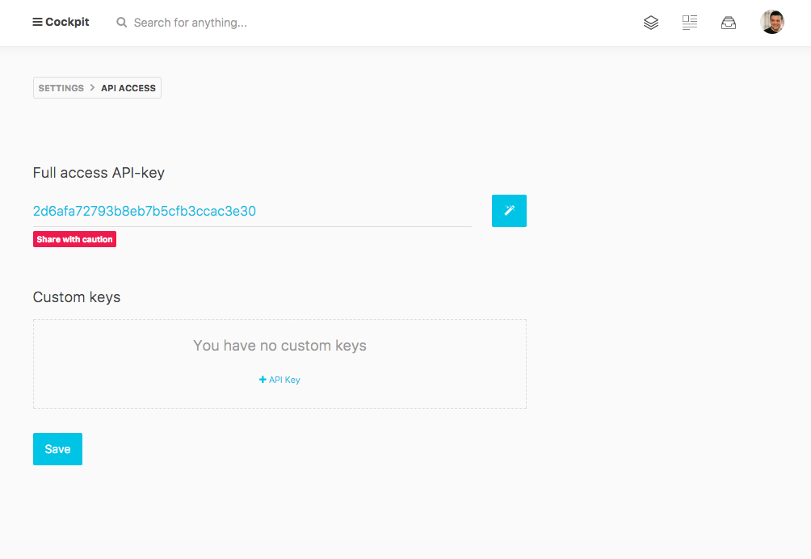

# TOKEN

Before accessing your data you need to create an API token. To do so please go to _Settings > API Access_ to generate your own unique API token. You can re-generate the token anytime you want.




## Custom API Tokens

*Custom keys* can be added as required. Each key has a set of Rules which specify which API endpoints the token is valid for. The default rule `*` means all endpoints.

To limit the token you can specify one permitted endpoint per line.

For example, let's say you just want to allow the collections get api, then the Rules should contain

`/api/collections/get`

If you just want to allow to query the posts collection with the token, then the Rules for this are:

`/api/collections/get/posts`

Or `/api/collections/get/(authors|posts)` for multiple collections.

The token can be passed to the Maya API in three ways. 

1. In a query parameter.
2. As a `Maya-Token` header.
3. As a `Bearer` token in the `Authorization` header.

```javascript
fetch('/api/collections/get/posts?token=xxtokenxx')
.then(res=>res.json())
.then(res => console.log(res));

// Maya token header.
fetch('/api/collections/get/posts', {
    headers: { 'Maya-Token': 'xxtokenxx' }
})
.then(res=>res.json())
.then(res => console.log(res));

// Bearer token in Authorization header.
fetch('/api/collections/get/posts', {
    headers: { 'Authorization': 'Bearer xxtokenxx' }
})
.then(res=>res.json())
.then(res => console.log(res));
```
