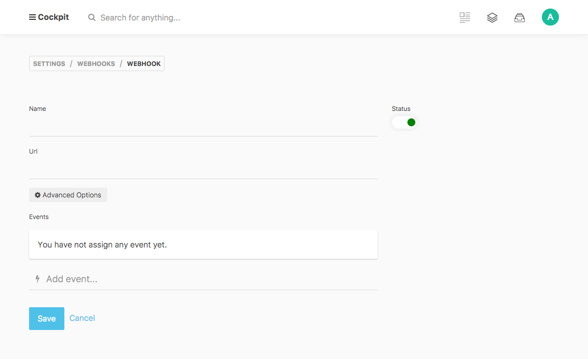
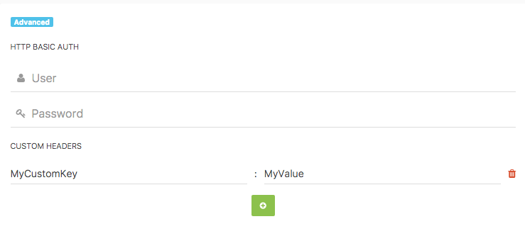

# Webhook

A webhook is a user-defined HTTP callback. It is a mechanism that sends real-time information to any third-party app or service.

Webhooks allow you to specify a URL to which you would like Maya to post data when an event happens. So, for instance, if you wish to be notified every time a new collection entry is created, you can create a webhook for it. Webhooks can be created for almost all events in Maya.


## Create a webhook




## Advanced options



All data will be send as _application/json_.

## Using POST-data in the webhook destination script

Some hooks send data along to the webhook destination script as hook is triggered (like some of the collection-event-hooks which send the fresh new collection's name and configuration).

The data is posted to the webhook destination script in RAW-Post format.

```
// PHP example to get the raw request body

$body = file_get_contents('php://input');
```

## List of events

- _admin.dashboard.widgets_
- _maya.filestorages.init_
- _maya.bootstrap_
- _maya.media.upload_
- _maya.media.removefiles_
- _maya.media.rename_
- _maya.update.before_
- _maya.update.after_
- _maya.clearcache_
- _maya.export_
- _maya.import_
- _maya.assets.list_
- _maya.assets.save_
- _maya.assets.remove_
- _maya.rest.init_
- _maya.api.authenticate_
- _maya.api.erroronrequest_
- _collections.createcollection_
- _collections.updatecollection_
- _collections.removecollection_
- _collections.find.before_
- _collections.find.after_
- _collections.save.before_
- _collections.save.after_
- _collections.remove.before_
- _collections.remove.after_
- _forms.save.before_
- _forms.save.after_
- _singleton.save.after_
- _singleton.remove_
- _singleton.saveData.before_
- _singleton.saveData.after_
- _singleton.getData.after_

Events triggered in backend views:

- _maya.account.editview_
- _admin.dashboard.top_
- _admin.dashboard.bottom_
- _app.layout.header_
- _maya.menu.aside_
- _maya.menu.main_
- _app.layout.contentbefore_
- _app.layout.contentafter_
- _app.layout.footer_
- _maya.view.settings.item_
- _maya.view.settings_
